 # 1. Elaborer la structure graphique de l’arbre XML
 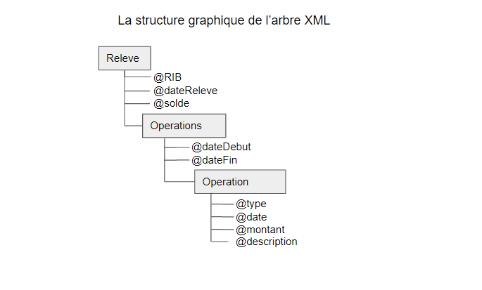

#  Créer un DTD qui permet de déclarer la structure de ce document XML

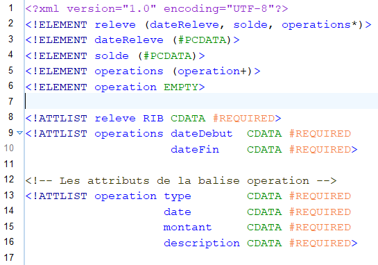

# et créer un exemple de document XML valide par ce DTD

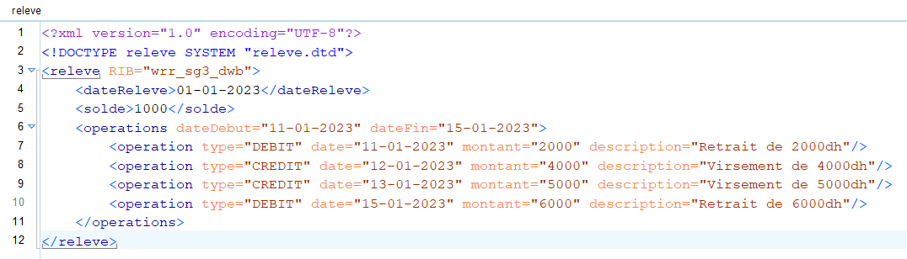

# 3. Créer un schéma XML qui permet de déclarer la structure de ce document XML

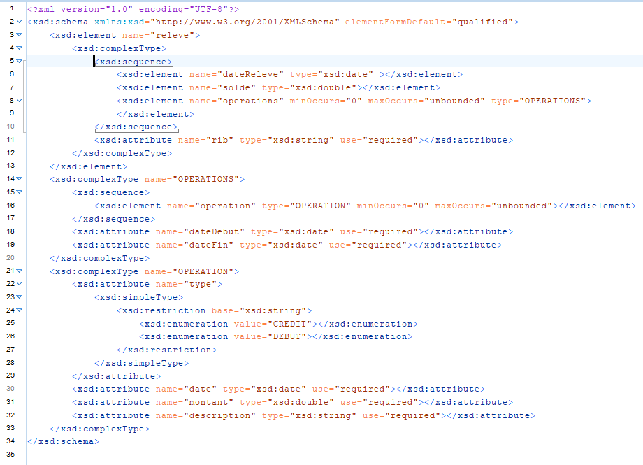

#  et créer un exemple de document XML valide par ce schéma XML

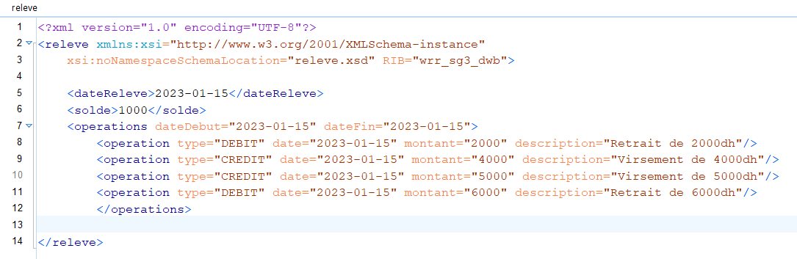

#  Créer une feuille de style XSL qui permet d’afficher les toutes les données de ce document XML au format HTML en affichant le total des opérations de débit et le total des opérations de crédit.

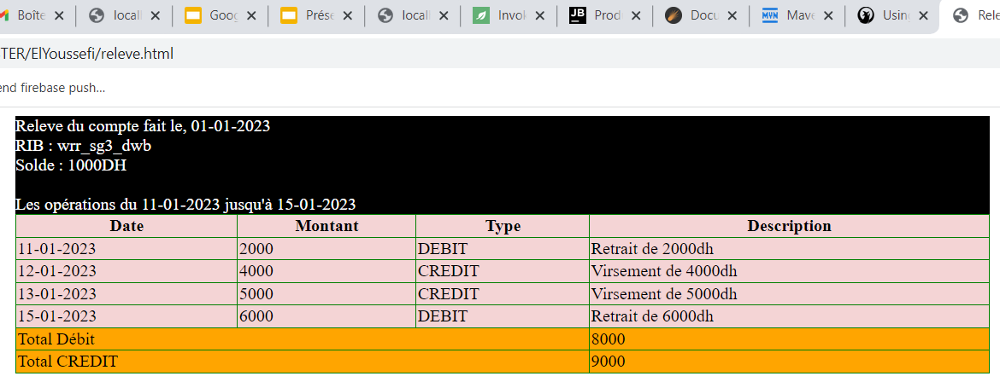

#  Créer une feuille de style XSL qui permet d’afficher au format HTML les opérations de type CREDIT d’un relevé bancaire.

# B. Partie Mapping Objet XML avec Jax Binding :  3 Créer une application Java qui permet de créer un Objet Releve avec quelques opérationset de sérialiser ces données dans un fichier XML.

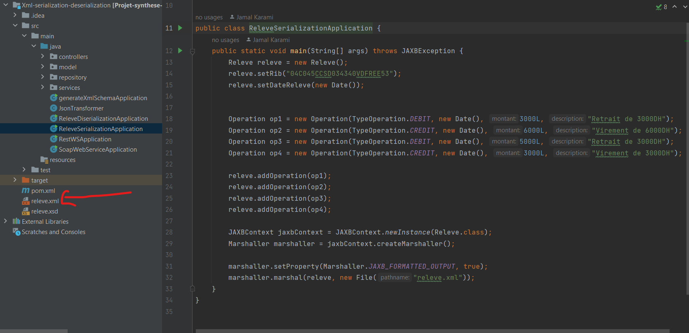

# 4. Créer une application Java qui permet de lire et d’afficher les données du relevé du fichier XML.

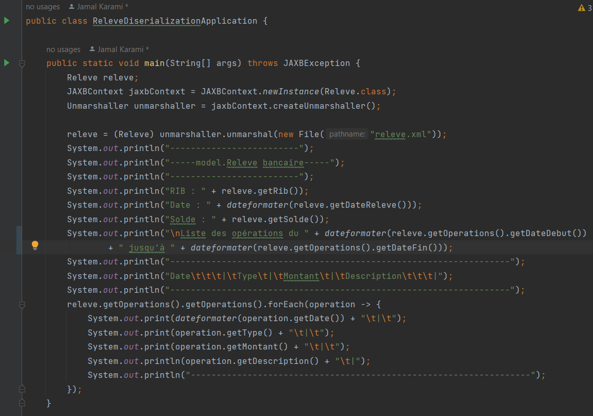

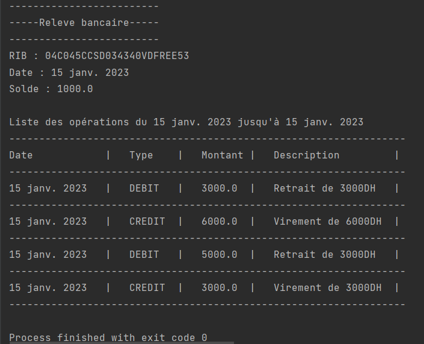

# 5. Créer une application Java qui permet de générer le Schéma XML représentant lastructure d’un relevé.

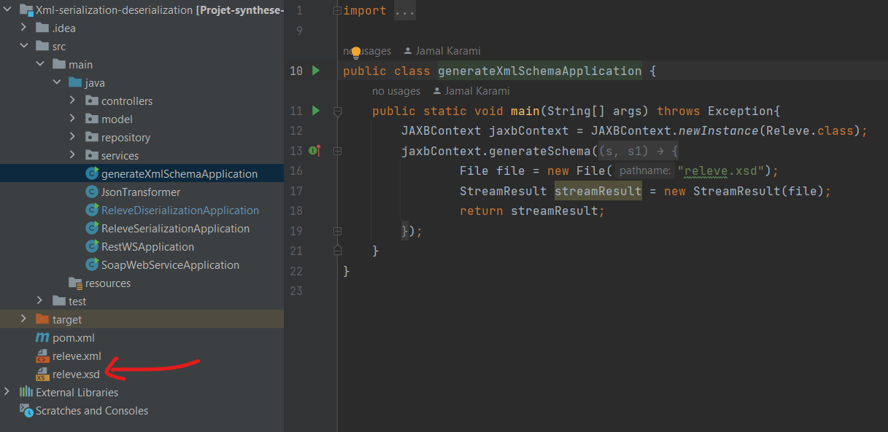

# C. Partie Web services SOAP WSDL avec JaxWS : Créer un serveur JaxWS pour déployer le Web service

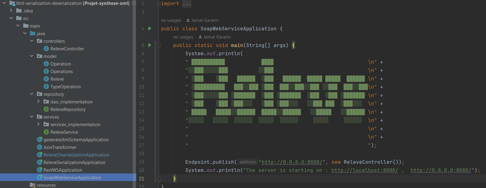

# 3. Analyser le WSDL en utilisant un Browser Web

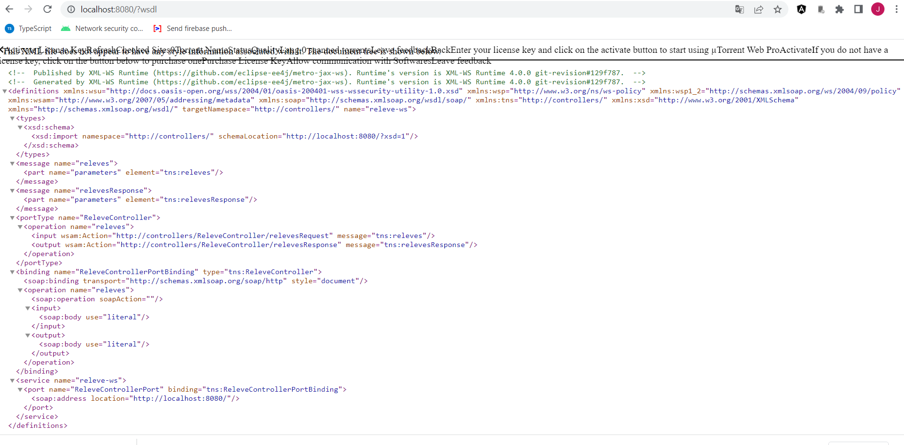

# 4. Tester les méthodes du Web services en utilisant SoapUI

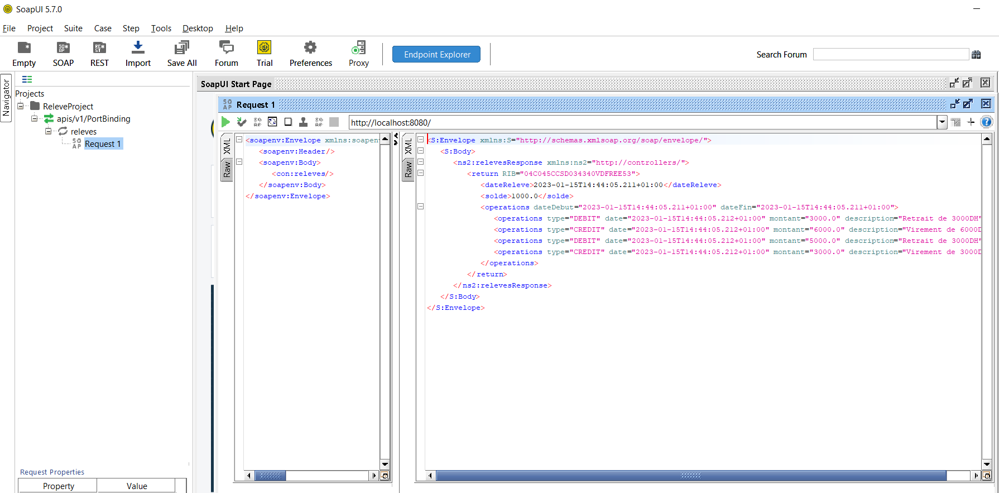

# 5. Créer un Client SOAP Java.

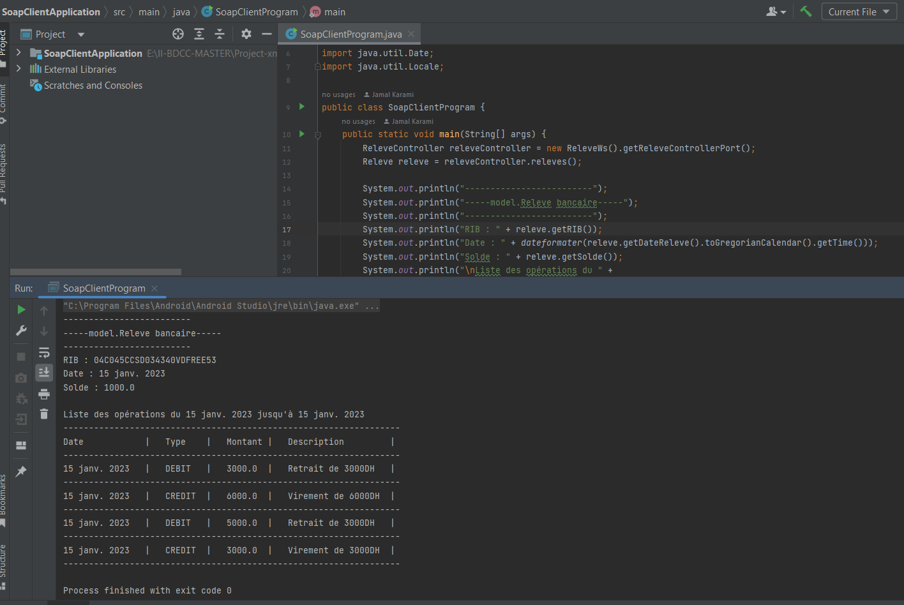

# D. Web services RESTful avec JAXRS ou Spark : Tester Le Web service avec un client REST (Browser Web)

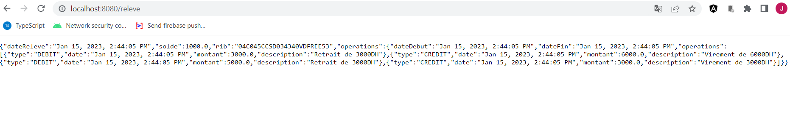

