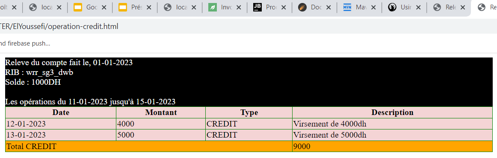

 # 1. Elaborer la structure graphique de l’arbre XML
 

#  Créer un DTD qui permet de déclarer la structure de ce document XML

# et créer un exemple de document XML valide par ce DTD

# 3. Créer un schéma XML qui permet de déclarer la structure de ce document XML

#  et créer un exemple de document XML valide par ce schéma XML

#  Créer une feuille de style XSL qui permet d’afficher les toutes les données de ce document XML au format HTML en affichant le total des opérations de débit et le total des opérations de crédit.

#  Créer une feuille de style XSL qui permet d’afficher au format HTML les opérations de type CREDIT d’un relevé bancaire.

